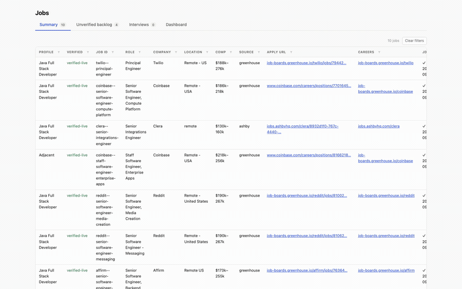

# HireFlow

**Your resume, tailored to every job — and the form already filled in.**

Claude Code as your job-search-and-apply agent. Drop in a resume, type `/job`, and it works
out what you're looking for, finds live postings, captures the job descriptions, and tailors
your resume to each one. When you're ready it fills out the application forms and leaves them
open in a real browser window — then stops, so **you** read them over and click Submit.

Nothing about you, and nothing about your field, is baked in. Your name and history come from
the resume you drop in; the roles it searches for are derived from that same resume and kept
in a config file you can edit. It works the same for a Java full stack developer as for an AI
engineer.

New here? [HOW-IT-WORK.md](HOW-IT-WORK.md) walks through every stage step by step.

## Demo



*([full-resolution MP4](docs/demo/hireflow-demo.mp4) — 25s)*

A real run, end to end: the jobs index after a search, scrolled right to the **JD / Resume /
Form / Status** columns · the dashboard's pipeline and fit stats · then a live Greenhouse
application form being filled — name, phone, and the tailored `resume.pdf` uploaded — ending
on the **Submit button, deliberately not clicked**.

Three things the clip is showing on purpose:

- **The agent stops at Submit.** The last shot is a complete-looking form and an untouched
  Submit button. That is the ceiling, by design — see [The guarantees](#the-guarantees).
- **Blank fields are blank on purpose.** Work authorization, sponsorship and the two policy
  acknowledgements are left empty because they were not in the answer bank. The agent does
  not guess a screening answer or accept a privacy policy on your behalf.
- **The name and phone are blacked out** in the recording, not in the product — this is a
  public demo of one real person's workspace.

## Quickstart

```bash
# 1. Drop your current resume in (PDF, DOCX, or Markdown)
cp ~/Downloads/my-resume.pdf jobs/input/profile/source-resumes/

# 2. In Claude Code, from this directory:
/job
```

That's the whole thing. `/job` runs the pipeline: reads the resume, proposes 3–4 role
families, searches, captures JDs, tailors a resume per job — and stops at `tailored`.

For control over what it searches, run `/job setup` first: it proposes role families from
your resume and asks you to keep, drop, or add. Only the ones you confirm are written to
`jobs/input/config/setup-families.md`, and from then on every search — including
`make daily` — targets exactly those. Without that file, the generic family list in
`search-profile.md` is the fallback.

Then fill the forms, either one at a time with you watching:

```
/job apply <job-id>     # fills the form, stops before submit
```

…or all of them at once, unattended:

```
/job apply --batch      # fills every tailored job, leaves the tabs open for you
```

Or run the entire loop — search, JDs, tailoring, form-filling — with one command:

```bash
make daily              # → a browser full of filled forms, waiting on your Submit
```

**Do this before the first batch run.** Fill in `jobs/input/config/application-answers.md` —
email, address, work authorization, sponsorship, target comp. Those are the fields every
application asks and the agent refuses to guess, so until they're there you'll get forms with
a dozen blanks instead of a couple. `/job setup` starts the file; you finish it.

**No resume yet?** Say what you want and it still searches:

```
/job java full stack developer
```

It builds a role family out of that phrase, searches, and captures JDs. It stops before
tailoring — that genuinely needs your resume — and tells you so. Drop the resume in later and
the next `/job` tailors everything it already found.

**Found a job yourself?** Paste the link, or the job description text:

```
/job https://job-boards.greenhouse.io/acme/jobs/123     # or several links at once
/job add <pasted job description>                      # no link, just the text
```

It verifies the posting, adds it as `shortlisted` (you picked it, so it skips triage), and
captures the JD. To collect links over the week instead, paste them into
`jobs/input/inbox.md` (`make init` creates it) — every `/job` and `make daily` picks up the
new ones.

**Want a second opinion before applying?** `/job evaluate <job-id>` writes a one-page
assessment — see [Is this job worth it?](#is-this-job-worth-it).

## Where jobs come from

Search runs against the ATS boards' **own public APIs** — Greenhouse, Lever and Ashby —
listed by company in `jobs/input/config/job-sites.md`. Every job they return is a live,
open req, and each response carries the full job description, so a role is matched on the
signals in its JD and not just words in its title. Then Hacker News "Who is Hiring?", then
LinkedIn, and only as a last resort a `site:` web search.

Edit the company list — that's the main dial for search quality. To add one, read the slug
off their careers URL (`jobs.lever.co/`**`veeva`**) and check it:

```bash
curl -s "https://boards-api.greenhouse.io/v1/boards/<slug>/jobs" | head -c 200
```

## Setting where you want to work

Searches default to the **United States**. Change it once, before running anything:

```
jobs/input/config/search-profile.md  →  Location & work mode  →  Countries: United States
```

Comma-separate to widen (`United States, Canada`), or `Anywhere` to turn the filter off. It's
a hard filter, not a preference — a job outside it is excluded rather than penalised, so a
perfect-stack role you can't legally take never outranks one you can. Override for a single
run with `/job <role> --country "United Kingdom"`.

## How it flows

```
   /job
     │
     ▼
  ┌─────────────────────────────────────────────────────────────────┐
  │ PASS 0   snapshot jobs.md → history/                            │
  │          resume? → extract it, derive 3–4 role families         │
  │          no resume but a focus phrase? → run degraded           │
  │          neither? → stop, nothing to search for                 │
  ├─────────────────────────────────────────────────────────────────┤
  │ PASS 1   SEARCH   job-sites.md × search-profile.md              │
  │                   gather ~3× the limit, rank, then verify       │
  │                   each is still live until the limit fills      │
  │          INBOX    new links in jobs/input/inbox.md → shortlisted│
  ├─────────────────────────────────────────────────────────────────┤
  │ PASS 2   TRIAGE   fit ≥ threshold (75) → shortlist, carry on    │
  │                   fit 40–74 → left for you to promote           │
  │                   hard-filter fail → skipped, reason logged     │
  ├─────────────────────────────────────────────────────────────────┤
  │ PASS 3   JDs      captured → jds/<job-id>.md                    │──┐
  │                   failed   → mark "manual", MOVE ON             │  │
  ├─────────────────────────────────────────────────────────────────┤  │
  │ PASS 3b  EVALUATE requirement match, gaps, pay, verdict         │  │
  │                   verdict "skip" → not tailored, listed for you │  │
  ├─────────────────────────────────────────────────────────────────┤  │
  │ PASS 4   TAILOR   every job with a JD but no tailored           │  │
  │                   resume yet · at most 4 in parallel            │  │
  │                   reorder + rephrase only, never invents        │  │
  ├─────────────────────────────────────────────────────────────────┤  │
  │ PASS 5   write jobs.md + tracker.md, report                     │  │
  └─────────────────────────────────────────────────────────────────┘  │
     │                                                                 │
     │   ══ ceiling: `tailored`. Never fills a form. ══                │
     ▼                                                                 │
  /job apply <job-id>   attended · one job · you watching              │
  /job apply --batch    unattended · every job · tabs left open        │
     │                                                                 │
     │   ══ ceiling: `filled-awaiting-user`. Never submits. ══         │
     ▼                                                                 │
  you review the tab and click Submit                                  │
  make submitted JOB=<job-id>   ← so it stops reappearing tomorrow     │
                                                                       │
   ┌───────────────────────────────────────────────────────────────────┘
   │  you paste the JD into jobs/output/jds/<job-id>.md
   │  (or drop the posting in as <job-id>-source.pdf)
   ▼
  /job   ← next run sees it, tailors that job. Nothing is lost.
```

**It reconciles, it doesn't sequence.** Every run asks each job "what state are you in, what's
the next possible thing?" — so a stuck job never stops the batch, finished work is never
re-done, and re-running on a settled workspace does almost nothing. There is no separate
"resume where I left off" mode, because every run is the same loop.

## Doing one stage at a time

`/job` chains them; each also runs alone.

| | |
|---|---|
| `/job setup` | read the resume, derive role families, fill the answer bank |
| `/job search` | search the configured sites |
| `/job <url>` · `/job add …` | add a job you found — a link, pasted JD text, or `--inbox` |
| `/job triage` | you pick what's worth applying to |
| `/job jd` | confirm postings are live, capture full JDs |
| `/job evaluate <job-id>` | written assessment: requirement match, gaps, level, pay, interview stories, apply/skip |
| `/job tailor --all` | one tailored resume per job |
| `/job apply <job-id>` | fill one form, you watching, stop before submit |
| `/job apply --batch` | fill every tailored job unattended, leave the tabs open |
| `/job status` | status board and follow-ups |
| `/job interviews` | real interview experiences from Reddit / HN |

And the parts you drive from the shell rather than from Claude Code:

| | | |
|---|---|---|
| `make daily` | the whole loop end to end — search per role family (Sonnet), triage/JD/tailor (Opus), fill forms (Sonnet), then the tabs | agent |
| `make morning` | re-open every mapped application, filled, in the browser | free |
| `make pdf` | render the tailored resumes to PDF in your own resume's layout | free |
| `make submitted JOB=<id>` | record that you submitted one | free |
| `make doctor` | health check: setup, and the index agreeing with the files | free |
| `make reset` | wipe the agent's output and start over | free |

"free" means no model call at all — pure scripts, seconds to run.

`/job` also takes a job ID (`/job acme--data-engineer` advances that job one stage) or plain
English (`/job what's still live?`).

## Layout

One skill, eleven task files, and a workspace split into what **you** provide and what **the
agent** produces.

```
.claude/skills/job/SKILL.md   the only skill — a router, no procedure

jobs/
  tasks/                      the eleven procedures the router dispatches to
                              auto · setup · search · add · triage · jd
                              evaluate · tailor · apply · status · interviews
  input/
    profile/source-resumes/   ← drop your resume here (the only source of identity)
    profile/                  master-resume.md, links.md      (built by /job setup)
    inbox.md                  ← links to jobs YOU found; /job picks up new ones
    config/                   job-sites.md      where to search — ATS board APIs first
                              search-profile.md generic role families, countries, filters,
                                                limits, the auto-tailor threshold
                              setup-families.md the families YOU confirmed in /job setup
                                                (when present, the only ones searched)
                              application-answers.md  the screening-question bank
                              resume-format.md  your resume's layout, measured by setup
                              resume-docx-map.json  where the text sits in your .docx
    templates/                the file formats the tasks write
  output/
    jobs.md                   the living index (what the dashboard reads)
    tracker.md                the status board (gitignored; `make init` seeds it)
    jds/<job-id>.md           full job descriptions
    applications/<job-id>/    evaluation.md   /job evaluate's assessment + verdict
                              resume.md · resume.pdf (· resume.docx) · cover letter · log.md
                              form-fill.json  the form's field map
                              refill.js       replay script for that form
                              screens/        what the filled form looked like
    run-log.md                one entry per run — what was searched, what was skipped
    history/                  timestamped jobs.md snapshots
    logs/daily-<date>.log     one log per `make daily` run (last 30)
  bin/
    snapshot.sh               backs up jobs.md before a run edits it
    daily-run.sh              make daily    — the whole loop, agent stages included
    morning-run.sh            make morning  — re-open every filled application
    fill-form.py              replays one form-fill.json into the visible browser
    make-refill.py            builds refill.js from form-fill.json
    refill-engine.js          the replay engine those scripts are generated from
    mark-submitted.sh         make submitted — your confirmation that you sent one
    reset.sh                  make reset    — back to a fresh start
    docx-resume.py            maps your .docx (setup) and edits a copy per job (make pdf)
    verify-tailored.py        flags invented figures, years, certs in a tailored resume
    check-setup.py            make doctor — profile/config ready, nothing personal committed
    check-index.py            make doctor — jobs.md, tracker.md and files on disk agree
  dashboard/                  Go web dashboard (make web) + the resume PDF renderer

interviews/                   interview-experience intel, separate namespace
  input/config/               ix-profile.md, ix-sources.md
  output/interviews.md        compiled experiences
  output/reports/             per-company prep briefs
  bin/ix-fetch.py             Reddit / HN fetcher
```

Two exceptions to input/output: `jobs/tasks/` is the agent's own procedure, and a posting you
download by hand goes to `jobs/output/jds/<job-id>-source.pdf`, next to the JD built from it.

## Where it stops and waits

By design, not by failure:

- **A JD it can't reach** → marked `⏳ manual`, run continues, all URLs reported once at the
  end. You paste; the next run tailors it.
- **A screening question not in the answer bank** → it asks, then saves the answer.
- **CAPTCHA, MFA, SSO, or an account signup** → hands off to you.
- **No resume and no focus phrase** → the one hard stop. There's nothing to search for.

`--batch` and `make daily` are the unattended forms, so they never stop to ask: an unanswered
screening question is left blank and reported, and a login or CAPTCHA makes it skip that job
and carry on. You get the list of what it couldn't answer at the end, once.

## The guarantees

- **It never submits.** The final click is always yours — and that holds for the scripts too:
  `fill-form.py` clicks only the form controls named in a job's field map and refuses
  anything that looks like a submit control, and `refill.js` clicks no button at all.
- **It never fabricates.** Tailoring reorders and rephrases what's already in your master
  resume. Gaps get flagged, not hidden.
- **It never guesses a screening answer.** Anything not in the answer bank, it asks.
- **It never applies twice** to the same job.
- **It never invents a job description.** If it can't reach a posting, it asks you to
  download it rather than guessing what the job wants.
- **It never tailors without a resume.** No "I'll work from the JD instead."
- **Your data stays local.** `jobs/input/profile/` goes to employer application forms and
  nowhere else. `.gitignore` keeps `master-resume.md`, `links.md`, `source-resumes/`,
  `application-answers.md`, `search-profile.md`, `setup-families.md`, `resume-format.md`, `inbox.md`,
  `resume-docx-map.json`, and all of `jobs/output/` out of version control; only the blank
  templates in `jobs/input/templates/` are committed.

## Is this job worth it?

```
/job evaluate <job-id>        # one job
/job evaluate --all           # every job with a JD and no evaluation yet
```

A fit score is one number; this is the reasoning behind it, written to
`jobs/output/applications/<job-id>/evaluation.md` and opened from the job's Status pill in
the dashboard:

- **A) Role summary** — what the job is, seniority, work mode, team, posted pay.
- **B) Requirement match** — every requirement in the JD next to the line of your master
  resume that evidences it, quoted, marked strong / partial / none. Each gap says whether
  it's a hard blocker, what adjacent experience you really have, and what you can
  truthfully say about it.
- **C) Level & positioning** — the JD's level vs yours, what to lead with, and what *not* to
  claim.
- **D) Pay** — the posted range plus public data (Levels.fyi, Glassdoor…) with sources, vs
  your floor. Only the role title, level and location go into the search — never your
  resume. No data → it says so; it never estimates.
- **E) Tailoring plan** — what `/job tailor` should emphasise; tailor reads it first.
- **F) Interview prep** — 3–6 situation/task/action/result stories built only from your
  master resume, plus the questions your gaps will draw.
- **G) Verdict** — `apply`, `apply-with-caveats`, or `skip`, with the reason.

It's advice: it never changes a job's status. `/job` runs it for every job it is about to
tailor and **doesn't tailor the ones it rates `skip`** — they're listed for you with the
reason, and `/job tailor <job-id>` overrules it. `/job auto --no-evaluate` turns the pass off.

## Health check

```bash
make doctor                   # both checks; exits non-zero on any error
```

- **Setup** (`check-setup.py`) — a resume is dropped in; the master resume is populated and
  not older than it; no `{{placeholders}}` left in the search profile; role families
  confirmed; work-authorization answers filled; the `.docx` map or measured layout in place
  for `make pdf`; `claude`, `go` and the browser present. And the one that protects a public
  repo: **nothing personal is committed** — your name, email and phone are searched for in
  every tracked file, and every per-user file must be untracked.
- **Index** (`check-index.py`) — every row in `jobs.md` has the right shape, a valid job ID
  and a real status; every ✓ in JD / Resume / Form has its file behind it; no status is
  ahead of its artifacts; no orphan JDs or folders; `tracker.md` agrees with `jobs.md`; a
  JD you dropped in that no run has picked up yet.

Both only read. A finding is fixed by re-running the task that owns it, or by hand after
`make snapshot`.

**It also runs by itself before every search.** `/job` and `make daily` run both checks
first. An **index error stops the run** before anything is searched or a token spent —
every stage merges into `jobs.md`, so searching into a broken one only spreads the damage.
**Setup findings never stop it**: no resume or no confirmed families are modes the pipeline
already runs degraded in, so they're printed as `DEGRADED` and listed under *Needs you* at
the end. `make daily --no-doctor` skips the check.

## The tailored resume as a PDF

```bash
make pdf                      # every job that has a resume.md
make pdf JOB=<job-id>         # just one
```

`/job tailor` writes the words (`resume.md`); this puts them back into **your own resume's
format**. Only the text changes from job to job, and only text that was already in
`resume.md`; the tailoring receipt at the bottom of the Markdown is stripped. The result is
`jobs/output/applications/<job-id>/resume.pdf` — the file `/job apply` uploads. Which route
it takes depends on what you dropped in:

- **You dropped in a `.docx`** — `/job setup` maps where your summary, skill lines, bullets
  and education sit (`jobs/bin/docx-resume.py map` → `jobs/input/config/resume-docx-map.json`).
  `make pdf` then copies **your own Word file** per job and swaps in only the tailored text,
  writing `resume.docx` and a Word-exported `resume.pdf`. The format is exactly yours because
  it *is* your file. The first run creates `.venv/` and installs `python-docx` into it.
- **Anything else (PDF / Markdown)** — `/job setup` measures page size, font, margins,
  headings, date style and column layout off the source file into
  `jobs/input/config/resume-format.md`, and `make pdf` renders every resume in that layout
  with headless Chrome. Nothing to install if you have Chrome (or the browser `/browse`
  already downloaded); `CHROME=/path/to/chrome make pdf` points it elsewhere.

To see the layout before making a file, open the resume in the dashboard and click
**print view ↗** — that is the same page the PDF is printed from, so ⌘P → Save as PDF gives
you the identical document.

## Filling applications in batch

```
/job apply <job-id>          # attended: one job, you watching, you submit
/job apply --batch           # unattended: fill everything fillable, ask nothing
make morning                 # re-open every mapped application, filled, in the browser
```

`--batch` walks your tailored jobs one at a time (never in parallel — one browser), fills
every field it can source from `master-resume.md` and `application-answers.md`, **really
uploads `resume.pdf`**, and stops at the review screen. It never asks you anything mid-run: a
screening question with no answer on file is left blank and reported, never guessed. Login
walls, account creation and CAPTCHAs make it skip that job rather than wait.

### It leaves the browser open — that's the handoff

Because a human has to click Submit, the run ends with **a real Chromium window on your
screen**, one tab per job, each holding a filled form with the resume attached. Browse runs
the browser as a long-lived daemon, so the window survives the run and the session: it stays
up until something runs `browse disconnect`. Look through the tabs whenever you like, fill
the blanks it listed, and submit the ones you want.

### The whole loop in one command

```bash
make daily                         # search → JDs → tailored resumes → filled forms on screen
```

Four stages, each agent stage on the model suited to it:

| Stage | What runs | What it does | Model | Cost |
|---|---|---|---|---|
| 1 | `/job search "<family>"` × each confirmed family | Searches the configured sites, drops duplicates by job ID, verifies what's still live. Mechanical work. | `SEARCH_MODEL` (sonnet) | agent run |
| 2 | `/job auto --skip-search` | Triages by the **Auto-tailor threshold**, captures JDs, tailors a resume per job. Judgment-heavy. Stops at `tailored`. | `REASON_MODEL` (opus) | agent run |
| 3 | `/job apply --batch` | Maps any newly tailored posting's form, fills it in the visible browser, uploads the PDF, records the field map. Never asks, never waits. | `APPLY_MODEL` (sonnet) | agent run |
| 4 | `jobs/bin/morning-run.sh` | Opens/refills **every** mapped, unsubmitted application, so the tabs are all there — including jobs stage 3 had nothing new to do. | — | free |

**What stage 1 searches depends on whether `/job setup` has run.** With a populated
`master-resume.md` and a `setup-families.md`, it runs one search per family you confirmed,
each with its own result limit. Without them, it runs a single
`/job search --limit $FALLBACK_LIMIT` (default 50) across `search-profile.md`'s generic
families, and stage 2 skips tailoring until there's a resume.

**How many resumes get written** is set by one number in `search-profile.md` →
*Fit scoring* → `Auto-tailor threshold` (default 75). Jobs at or above it are tailored; 40 up
to the threshold wait for you to promote them.

Override any of it per run:

```bash
SEARCH_MODEL=haiku REASON_MODEL=opus FALLBACK_LIMIT=25 make daily
```

Before stage 1 it runs the `make doctor` checks and stops if `jobs.md` has errors (see
[Health check](#health-check)); `--no-doctor` skips that. `--no-search`, `--no-tailor` and
`--no-apply` skip stages 1, 2 and 3. A lock file stops a
manual run and the scheduled one colliding on `jobs.md`, and each run logs to
`jobs/output/logs/daily-<date>.log` (last 30 kept). Stage 4 restarts the browser by itself if
the window was closed since yesterday.

**On cost.** "Agent run" means it consumes your Claude plan's usage, the same as typing the
command yourself — not a separate API bill, unless you have `ANTHROPIC_API_KEY` set, which
switches Claude Code to metered API billing. Stage 2 is the expensive one (whole JDs and a
tailoring pass per job, on the strongest model); stage 4 costs nothing at all. On a Pro plan a full run
every morning can eat into the window you wanted for your own work, so a reasonable split is
`daily-run.sh` two or three days a week and `morning-run.sh` on the others — new postings
don't appear fast enough to justify searching daily.

### Just the tabs, no agent

```bash
make morning                       # every mapped job
make morning JOB=<job-id>          # one
```

No agent and no tokens: it replays the field maps `--batch` already wrote, one tab per job,
in seconds. It re-uses a tab already open on the same posting, so running it every day does
not bury your desktop, and it skips anything already `submitted`. Jobs it has never mapped
are listed rather than filled — mapping a new posting needs the agent once
(`/job apply --batch <job-id>`), and every morning after that is mechanical.

### How it avoids doing the same job twice

Yesterday's posting reappearing in today's search is handled at three separate layers, and
one of them needs you:

1. **The search** dedupes on the job ID (`<company-slug>--<role-slug>`). A job ID already
   present in any of `jobs.md`'s three tables — or in the tracker — is excluded and counted
   as a duplicate. An existing row is never reset: Status, JD, Resume and Form survive every
   later search, so a job you already tailored can't fall back to `found`.
2. **The morning run** only opens jobs that have a field map, skips anything marked
   `submitted`, and re-uses a tab already open on that posting instead of opening a second
   one. Run it five times and you get the same one tab, refilled.
3. **You mark what you sent.** Nothing can detect your Submit click, so until you say so the
   job stays `filled-awaiting-user` and keeps coming back each morning:

   ```bash
   make submitted JOB=<job-id>       # Status → submitted, +14-day follow-up in the log
   ```

   This is the one step the loop needs from you beyond the click itself.

Where it can still trip: **slug drift.** If the company reposts the same role with a changed
title — "Senior Software Engineer" → "Senior Software Engineer, Backend" — the slug differs,
so it lands as a new row and could be applied to twice. Same-title reposts under a new req
ID are fine (same ID, row kept), though the stale Apply URL may 404, in which case the run
reports every field as not-found rather than filling the wrong page.

### Running it every morning by itself

**Nothing is installed by default** — the workspace never adds a scheduled job to your
machine. If you want one, it has to run in your logged-in desktop session (a cron job in a
headless context can open a window nobody can see), which on macOS means a launchd agent:

```bash
# 1. Write ~/Library/LaunchAgents/com.jobs.daily.plist
cat > ~/Library/LaunchAgents/com.jobs.daily.plist <<'PLIST'
<?xml version="1.0" encoding="UTF-8"?>
<!DOCTYPE plist PUBLIC "-//Apple//DTD PLIST 1.0//EN"
  "http://www.apple.com/DTDs/PropertyList-1.0.dtd">
<plist version="1.0">
<dict>
  <key>Label</key>              <string>com.jobs.daily</string>
  <key>ProgramArguments</key>
  <array>
    <string>/bin/bash</string>
    <string>-lc</string>
    <string>cd <ABSOLUTE PATH TO THIS REPO> &amp;&amp; jobs/bin/daily-run.sh --unattended</string>
  </array>
  <key>StartCalendarInterval</key>
  <array>
    <dict><key>Weekday</key><integer>1</integer><key>Hour</key><integer>7</integer><key>Minute</key><integer>30</integer></dict>
    <dict><key>Weekday</key><integer>2</integer><key>Hour</key><integer>7</integer><key>Minute</key><integer>30</integer></dict>
    <dict><key>Weekday</key><integer>3</integer><key>Hour</key><integer>7</integer><key>Minute</key><integer>30</integer></dict>
    <dict><key>Weekday</key><integer>4</integer><key>Hour</key><integer>7</integer><key>Minute</key><integer>30</integer></dict>
    <dict><key>Weekday</key><integer>5</integer><key>Hour</key><integer>7</integer><key>Minute</key><integer>30</integer></dict>
  </array>
  <key>StandardOutPath</key>    <string>/tmp/jobs-daily.log</string>
  <key>StandardErrorPath</key>  <string>/tmp/jobs-daily.err</string>
</dict>
</plist>
PLIST

# 2. Replace <ABSOLUTE PATH TO THIS REPO> with the real path, then load it
launchctl load ~/Library/LaunchAgents/com.jobs.daily.plist

# Check / run now / remove
launchctl list | grep com.jobs.daily
launchctl start com.jobs.daily
launchctl unload ~/Library/LaunchAgents/com.jobs.daily.plist && rm ~/Library/LaunchAgents/com.jobs.daily.plist
```

Weekdays at 07:30. `Weekday` is 1=Monday … 5=Friday; drop entries or change `Hour`/`Minute`
to taste. It runs in your GUI session, so the browser window appears on your desktop — and
if the Mac is asleep at 07:30, launchd runs it when the machine wakes.

Weekdays at 07:30, running the full four-stage loop. Swap `daily-run.sh --unattended` for
`morning-run.sh` if you'd rather the schedule only re-opened yesterday's tabs and never spent
tokens. Each run's detail lands in `jobs/output/logs/daily-<date>.log`; launchd's own copy of
stdout goes to `/tmp/jobs-daily.log`.

**Permissions.** An unattended agent can't answer a permission prompt, so `--unattended`
passes `--permission-mode bypassPermissions`. That bypasses the *approval prompts* for tool
calls; it does not loosen this workspace's rules — never submit, never fabricate, never guess
a screening answer — which are instructions the agent follows, not approval gates. Set
`PERMISSION_MODE=acceptEdits` (or any other mode) in the plist's environment if you'd rather
maintain an explicit allowlist in `.claude/settings.json`.

The one thing it will never do is **submit**. That's yours, always — and afterwards
`make submitted JOB=<job-id>` so it stops reappearing.

### If the window is gone

Two fallbacks, both in `jobs/output/applications/<job-id>/`:

- **`jobs/bin/fill-form.py <job-id>`** — preferred. Re-opens the posting in the visible
  browser and refills it, attachment included.
- **`refill.js`** — for a browser this workspace isn't driving. Open the form, paste it into
  DevTools → Console (Chrome asks you to type `allow pasting` once), and the recorded answers
  go back in; you attach the resume yourself, because browsers forbid scripted file inputs.
  `refill-bookmarklet.txt` is the same thing as a one-click bookmark. The dashboard has it
  behind a job's Status pill → `refill.js` → **copy all**.

`form-fill.json` is the field map both are built from — edit it and run `make refill` to
regenerate, or `make morning` to re-apply it to the live form.

Neither tool can submit: `refill.js` clicks no buttons at all, and `fill-form.py` clicks only
form controls and dropdown options named in the field map, refusing anything that looks like
a submit control.

## Starting over

```bash
make reset ARGS=--dry-run     # list exactly what would go, delete nothing
make reset                    # wipe the agent's output (type "reset" to confirm)
make reset ARGS=--profile     # ALSO wipe your resume, links and answer bank
make reset ARGS="--all --yes"  # everything including bin/, no prompt
```

**Goes:** `jobs/output/` — `jobs.md`, `run-log.md`, `history/`, `jds/`, `applications/`,
`logs/` — and `interviews/output/`. `tracker.md` is restored to the blank board rather than
deleted, and the empty directories come back with their `.gitkeep`.

**Stays:** everything you provided — `jobs/input/profile/` (source resumes, master resume,
links) and `jobs/input/config/` (job sites, search profile, answer bank) — plus the task
files, templates and the dashboard. So a plain reset clears the job hunt and keeps the setup;
`/job` starts searching again immediately.

`--profile` goes further and takes the personal files too, which is a true factory state: you
then need to drop a resume back into `jobs/input/profile/source-resumes/` and run
`/job setup`. It asks for a second confirmation before doing that.

Everything removed is archived to `.resets/reset-<timestamp>.tar.gz` first (skip with
`--no-backup`), so an accidental reset is one `tar -xzf` away. It also stops the dashboard and
closes the browser session before deleting — a filled tab whose tracker row is about to
vanish is worse than no tab. Without a terminal to confirm at, it refuses unless you pass
`--yes`.

## The dashboard

```bash
make web                    # → http://localhost:8080, runs in the background
make stop                   # stop it
make status                 # is it running, and on what port
make web-fg                 # run it in this terminal instead (Ctrl+C to stop)
```

`make web` starts the dashboard **in the background** and hands your terminal back; its output
goes to `jobs/output/logs/dashboard.log`. Running it again restarts it — do that after
changing the dashboard code, since the page is compiled in. `make stop` stops it.

Tabs for **Summary**, **Unverified backlog**, **Interviews**, and **Dashboard** (stats). It
re-reads `jobs/output/jobs.md` on every request, so a status change written by `/job apply`
shows on refresh. No build step, no dependencies, stdlib only.

What it surfaces beyond the table:

- **Open the tailored resume from the row** — once a job is tailored, its **Status** pill
  and the ✓ in the **Resume** column are links. Clicking one slides the resume in beside the
  table, with a tab for every other document that job has — the captured job description, the
  PDF, the cover letter, the log, and the `refill.js` replay script with a **copy all**
  button. Esc closes it; "open in a tab ↗" gives it a page of its own at `/doc?job=<job-id>`,
  and **print view ↗** shows the resume in the layout the PDF is printed from. Only rows
  whose file is actually on disk are linked.
- **Where each job stands** — the **Status** column plus **JD / Resume / Form** (`✓ <date>`,
  `⏳ manual`, `—`). There was a computed **Stage** column saying the same thing in one word;
  it is off, because it restated three columns already in the row. The stage itself still
  drives the Dashboard tab and the Needs-you panel, and `showStage` in
  `jobs/dashboard/main.go` brings the column back.
- **Sort and filter from the column header** — click a column name to sort, click again to
  reverse. Click the funnel beside it for that column's filter: a searchable checklist of
  the values actually present, each with a row count, plus select all / clear and
  Apply / Reset. Tick several to accept any of them. A filtered column is marked with a dot,
  filters across columns combine, and both filters and sort survive a refresh.
- **Needs you** — every `⏳ manual` job with a link to its posting, so blocked work is
  visible rather than buried in a run report you've scrolled past.
- **Pipeline** — how many jobs have a JD, a tailored resume, a filled form.
- **Profile** — the split across role families, so parallel job hunts stay legible.
- **Snapshots** — every run backs up `jobs.md` to `jobs/output/history/` first. To view one,
  append its filename: `http://localhost:8080/?v=jobs-2026-09-07T09-44-35.md`
  (`make history` lists them).

## Every command

`/job` and its tasks run inside Claude Code. Everything else is a make target — `make` on its
own lists them.

| | |
|---|---|
| **the loop** | |
| `make daily` | search → JDs → tailored resumes → filled forms on screen |
| `make morning` | re-open every mapped, unsubmitted application, filled (no agent, no tokens) |
| `make submitted JOB=<id>` | record that **you** submitted one — stops it reappearing tomorrow |
| **artifacts** | |
| `make pdf` | render every tailored `resume.md` to `resume.pdf` (`JOB=<job-id>` for one) |
| `make refill` | regenerate the replay scripts from each job's `form-fill.json` |
| **the board** | |
| `make web` | run the dashboard in the background (`make stop` stops it; `make web-fg` for foreground) |
| `make stop` / `status` | stop a running dashboard · is one running, and where |
| `make stats` / `ix-stats` | print job / interview counts without starting a server |
| `make snapshot` / `history` | back up `jobs.md` now · list the snapshots |
| **housekeeping** | |
| `make init` | seed `tracker.md` and `jobs/input/inbox.md` from their templates (never overwrites) |
| `make doctor` | setup + index health check, read-only (`doctor-setup` / `doctor-index` for one) |
| `make reset` | wipe the agent's output and start fresh (`ARGS=--dry-run` to preview) |
| `make build` / `run-bin` | compile to `bin/`, optionally run it |
| `make check` | fmt + vet + build |
| `make clean` | remove `bin/` |

Override the port or file: `make web PORT=9000 JOBS=/other/jobs.md`

Full rules and conventions: `CLAUDE.md`. The procedures the agent follows are plain Markdown
in `jobs/tasks/` — edit one and the next run uses it.
